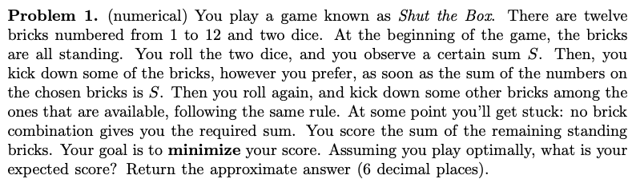

# Shut the Box with Dynamic Programming

## Question Description

## Approach

This is my attempt at solving the above question using dynamic programming. The main idea is to consider each of $2^n$ possible boards with `n` bricks (each of which can be either up or down), starting from the board that is completely solved (all bricks down) moving to progressively less solved boards with `[1,...,n]` bricks up. For each board, we consider all dice pairings and find for each dice pairing the set of bricks we want to put down to minimise the expected score. Dynamic programming comes into play, because there are multiple paths to encountering a given board from a less solved board (e.g., there are many partially solved boards which can eventually lead to the completely solved board). We can therefore save the expected score of the more solved boards we encounter first, since we may encounter them again when considering less solved boards later.

The optimal strategy then specifies for each board and roll of dice which bricks need to be put down to minimise the expected score. Following this strategy, I obtained an average score of 35.09 across 100,000 trials.

The problem was set and a hint of using dynamic programming was given by Francesco Vigano of Imperial College London.